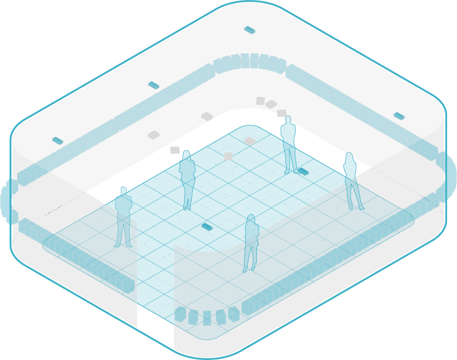

# The CRAIVE-Lab


<figure><figcaption><p>The CRAIVE-Lab</p></figcaption></figure>

This production manual contains all things related to content creation at the CRAIVE-Lab, which includes what you need to create your own project in the space, all in one place!&#x20;

## About this documentation

This documentation contains information for you, the designer, to create a variety of contents using the CRAIVE-Lab. Our focus here is to introduce you to the basic affordances of its infrastructure, from hardware to software. You will learn about things that you can do based upon over a decade of prior experiences from researchers, designers, developers, and educators.

The CRAIVE-Lab is an ever-changing facility. New infrastructural components and new technologies are constantly developed to enhance its potentials as a multi-user virtual reality system. We do our best to update this documentation to make sure that it is timely. Make sure to check it out frequently for the latest information.&#x20;

Contribution to the CRAIVE-Lab and this documentation are all welcome.

## Citation

This documentation is created based upon a [spatially-aware group interaction design framework](https://www.sciencedirect.com/science/article/abs/pii/S000368702300114X?via%3Dihub) for room-oriented immersive system (ROIS). If you are interested in developing contents at the CRAIVE-Lab for your academic works, you can cite this documentation along the line of:


**Citation Recommendations**

* We used a spatially-aware group interaction design framework to facilitate our design of the interactive platform for the CRAIVE-Lab (Huang et al., 2023);
* We developed our collaborative multi-user application at the CRAIVE-Lab by adopting a design strategy based upon the hardware-specific design modalities provided in Huang et al. (2023);
* The artwork created at the CRAIVE-Lab adopts elements of the facility's topological distinctions specified in the group interaction design framework (Huang et al., 2023) for a mediated relationship between its content and the immersed collective;
* For our study of auditory spatial perception, we adopted a spatially-aware group interaction design framework (Huang et al., 2023) for experimental design at the CRAIVE-Lab.


The `.bib` item is provided below:

```
@article{huang2023rois,
    title = {Spatially-aware group interaction design framework for collaborative room-oriented immersive systems},
    author = {Huang, Mincong and Chabot, Samuel R. V. and Leitão, Carla and Krueger, Ted and Braasch, Jonas},
    journal = {Applied Ergonomics},
    volume = {113},
    pages = {104076},
    year = {2023},
    doi = {https://doi.org/10.1016/j.apergo.2023.104076},
    publisher = {Elsevier}
}
```
