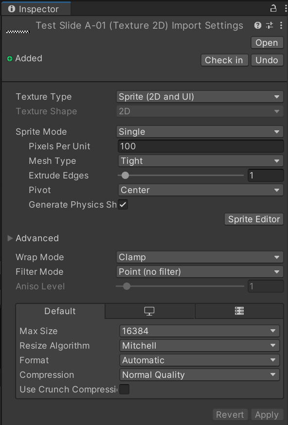
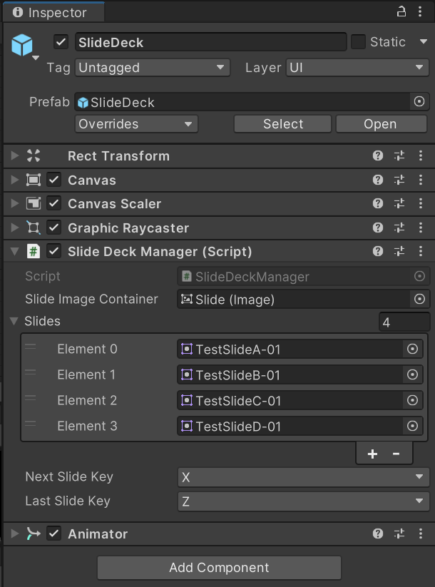

# Create panoramic slide decks in Unity

## Before you begin...

Here is a list of things you should have on your computer:

* [ ] A set of panoramic images stored in a designated folder you created in the **Assets** folder of your Unity project. These images can come from [Illustrator](../infrastructure/visual-display-system.md), [panoramic cameras](display-panorama-from-spherical-cameras.md) or [V-ray renders](create-panoramic-renders-using-v-ray.md). The dimensions of these images should be 15360x1200;&#x20;
* [ ] A scene in your Unity project designated for the slides; and
* [ ] The CRAIVE-Lab Special Assets package for Unity.

In general, the procedure is very much a drag-and-drop process, with some preparation of your slide images.&#x20;


Ideally, our image format should be .jpg or .png. For optimal file size, when exporting your image, please make sure to make its resolution relatively small (ideally 72 ppi).


## Sprite Conversion

### Step 1

Select your slide image in the designated folder you made in the **Assets** folder. On the inspector, you should see the image's Import Settings.

<figure><figcaption>
The Import Settings interface of the slides with the correct setting.
</figcaption></figure>

### Step 2

Change the following import setting parameters to their respective values:

<table><thead><tr><th width="217">Parameter</th><th>Value</th></tr></thead><tbody><tr><td>Texture Type</td><td><strong>Sprite (2D and UI)</strong></td></tr><tr><td>Filter Mode</td><td><strong>Point (no filter)</strong></td></tr><tr><td>Max Size</td><td><strong>16384</strong></td></tr></tbody></table>

### Step 3

When you finish, click on **Apply**. You should then have a **Sprite** image with no fuzzy edges and an enlarged file size.


You can select multiple images of the same type and configure them collectively.


## Slide Loading

### Step 4

Import the special asset package into your Unity project. Under **C03\_Slides --> Prefabs**, you should be able to find the **SlideDeck** prefab. Drag it to the scene you designated for the slides.&#x20;

### Step 5

Click on the **SlideDeck** in your scene. In the Inspector, you should see a C# scripting component called **Slide Deck Manager**.

<figure><figcaption>
Slide Deck Manager in the SlideDeck prefab, with 4 placeholder slides loaded.
</figcaption></figure>

### **Step 6**

In the **Slide Deck Manager** component, under **Slides**, type in the number of slides you have (in the above image: **4**). When you do this, a column of input elements will show up prompting you to put Sprites in (in the above image, **Element 0-3**).

Drag all your slide images, now as Sprites, in the correct order you wish to present.&#x20;


Optionally, you can change the keys you want to use to control the switching of slides by clicking on the drop-down menu for both **Last Slide Key** and **Next Slide Key**.


### Step 7

Hit play and enjoy!


Additional process that handle scene transition may be added in this scene for interactive demos using other scenes.&#x20;

However, this process is not limited to the specific infrastructural requirements of the CRAIVE-Lab and other ROIS, and therefore is not included as part of the special asset package.



**Current Limitations**

The slide deck is used for panoramic images only.&#x20;

The slide deck is designed to loop sequentially. However, you cannot jump to a particular slide just yet. Work is underway to address this issue.

