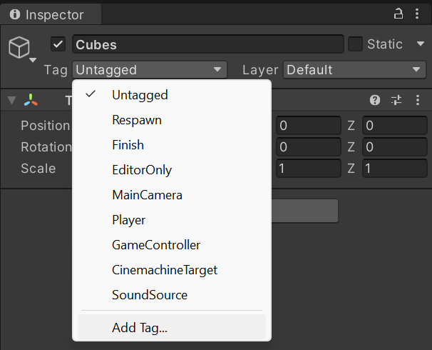
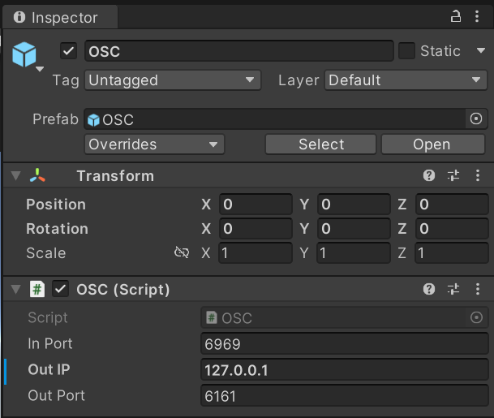
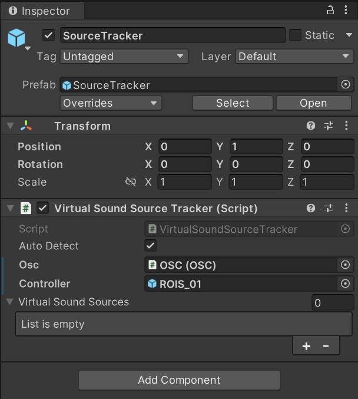

# Create spatial soundscapes in Unity


This guide assumes that you know how to [use a panoramic controller in Unity](use-first-person-controllers-in-unity.md). Please familiarize yourself with that process before proceeding.


## Before you begin...

Here is a list of things you should have on your computer (and yes, this can be your checklist):

* [ ] A number of audio files, preferrably saved into a designated folder;
* [ ] A Unity scene with GameObjects that you want to map virtual sound sources to; and
* [ ] The CRAIVE-Lab Special Assets package for Unity imported into your project.


**Pro tips!**

1. It is a great idea to make a visual map (artisanal or otherwise) that specifies the correspondence between individual GameObjects in your Unity scene and the individual audio files. This ensures that your soundscape is spatially accurate, and prevents you from creating confusions during the design process;
2. Before you set up spatial audio at the CRAIVE-Lab, it is also a great idea to simulate your spatial soundscape in a binaural setting. You can use Unity's own AudioSource and AudioMixer components to do so. And remember to disable or these components when you are happy with the simulated results.


## Preparing sound sources

### Step 1

Select any GameObject in your Hierarchy tab. On the Inspector, click on the **Tag** dropdown menu, and select **Add Tag...** .

<figure><figcaption>
Inspector and tag.
</figcaption></figure>

### Step 2

Click on the `+` icon under **Tags,** and add a tag called <mark style="color:yellow;">**SoundSource**</mark>.


The spelling here should be exact: the tags are case-sensitive and space-free.



You also have the option to skip this step, and instead manually assign the sound sources to the Virtual Sound Source Tracker later. See Step 7 for details.


### Step 3

Select all your GameObjects that you intend to assign as virtual sound sources in the **Hierarchy** tab of your project. Assign their **Tag** to <mark style="color:yellow;">**SoundSource**</mark>.

## Adding Open Sound Control (OSC)

### Step 4

In the **Assets** folder, under **C02\_OSC --> Prefabs**, drag the **OSC** prefab into the **Hierarchy** tab. In the inspector, the OSC prefab should look like this:

<figure><figcaption>
The OSC prefab in the inspector.
</figcaption></figure>


The implementation of this OSC component comes from [Thomas Fredericks](https://thomasfredericks.github.io/UnityOSC/) in 2015.


### Step 5

In the Inspector, change the **Out IP** of the **OSC** component to the IP address of the audio processing computer that you intend to communicate with. &#x20;


By default, the Out IP is `127.0.0.1`, which refers to your own computer. Please ask one of the [active collaborators](../contributing-to-the-craive-lab.md) about the IP address of the CRAIVE-Lab's audio workstation computer, as well as the proper **In Port** and **Out Port**.


## Adding Virtual Sound Source Tracker

### Step 6

In the **Assets** folder, under **C02\_OSC --> Prefabs**, drag the **SourceTracker** prefab into the **Hierarchy** tab. In the Inspector, the SourceTracker prefab should look like this:

<figure><figcaption>
The SourceTracker prefab in the Inspector.
</figcaption></figure>

### Step 7

From here, you have two options:

* If you have tagged your GameObjects as SoundSource, then all you need to do is to check the **Auto Detect** box;
* Otherwise, you can specify the number of sound sources for the Virtual Sound Sources list in the **SourceTracker --> Virtual Sound Source Tracker** component, and drag the GameObjects in the Hierarchy tab that you would like to designate as virtual sound sources one by one into the list.

### Step 8

Hit play and enjoy!


The OSC messages are sent to a Max 8 patch in the audio workstation. For more information how to set up this Max patch, please consult one of our [active collaborators](../contributing-to-the-craive-lab.md).

