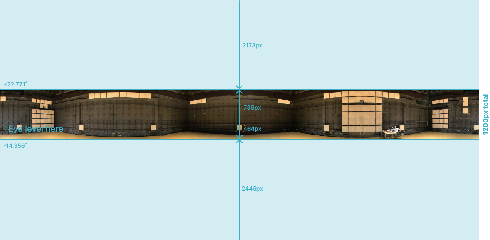
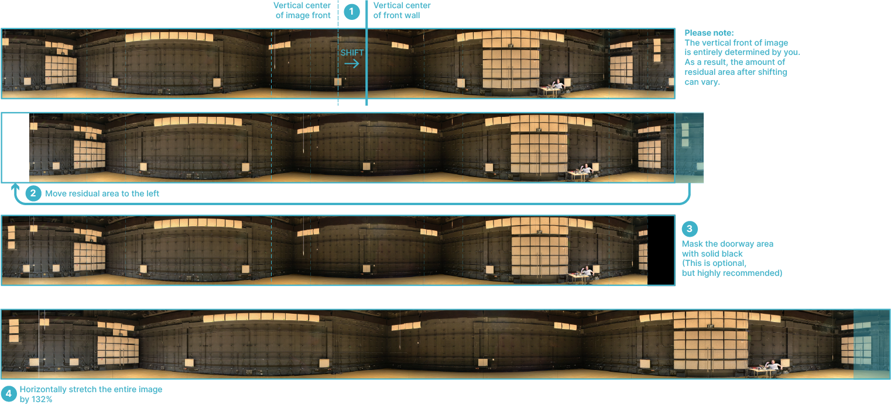

# Display panorama from spherical cameras

Usually, a photo or video captured from a spherical camera would have a 2:1 aspect ratio (see below). For optimal quality and congruence, it is suggested that the visuals have a minimum width of 11636px, the pre-stretched pixel resolution.&#x20;

<figure><figcaption>
A panoramic image captured from a spherical camera.
</figcaption></figure>

### Step 1

When capturing the visuals, be sure to position the camera so that the horizontal plane (0˚ in elevation) is promptly aligned with a typical eye level (about 1.65m or 5'5"), and orient the camera so that the median plane (0˚ in azimuth) is promptly aligned with the forward direction of the environment.

<figure><figcaption>
Horizontal cropping of spherical panorama.
</figcaption></figure>

### Step 2

The captured visuals are then scaled to `11636px` wide with proportion preserved, and cropped horizontally to the dimensions shown above.&#x20;

If you have visuals of different dimensions, the equations to determine the horizontal pixel location for cropping can be expressed as follows:

$$
\text{P}_+ \approx 0.1265h; \quad \text{P}_- \approx -0.0797h,
$$

with **P+, P-** being the pixel offset from eye level, rounded to the nearest integer, and **h** being the height of the image.&#x20;

<figure><figcaption>
Visualized editing steps that needs to be taken for the final image displayed at the CRAIVE-Lab.
</figcaption></figure>

### Step 3

The cropped visuals should then be vertically adjusted to account for orientation and distortion. A visual breakdown for the steps taken can be found in the above image. Here, it is described in greater detail:

1. Identify the vertical center of your panoramic visuals. This is the position where you want your visual environment to be oriented relative to the front side of the visual display, facing away from the entrance; shift your visuals to align this position with the vertical center of the front side;
2. The shifting results in a residual area of visuals being generated outside of the display region. Move this area to the left to fill the gap;
3. Optionally, mask the visual area that covers the physical entrance of the CRAIVE-Lab as solid black, so that no visuals bleeds outside of the enclosure defined by the visual display;
4. Horizontally stretch the image by 132%, so that the final image has the pixel resolution of 15360x1200.

Voilà! You are done. Now you can show this visuals directly at the CRAIVE-Lab, or use a correction tool to further mitigate perspective distortions.&#x20;


Alternative tool are available for generating seamless equirectangular images from real-world single-shot camera capture, such as [<mark style="color:blue;">Microsoft Research's Image Composite Editor</mark>](https://www.microsoft.com/en-us/research/project/image-composite-editor/)_<mark style="color:yellow;">.</mark>_

