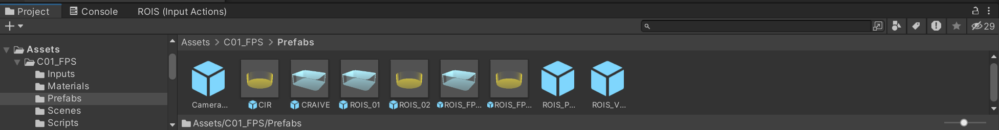

# Use first-person controllers in Unity

## Before you begin...

Here is a list of things you should have on your computer:

* [ ] A Unity scene with some ground-like surfaces attached with MeshCollider; and
* [ ] The CRAIVE-Lab Special Assets package for Unity.

You should also have the following packages installed in your Unity project:

* [ ] Universal Render Pipeline (Universal RP);
* [ ] Shader Graph;
* [ ] Cinemachine; and&#x20;
* [ ] Input System.


**Double Check!**\
Make sure that your Unity project is capable of interfacing with both the new Input System and the old one. To check this, you can go to **Edit >> Project Settings...**, and find that both **Input Manager** and **Input System Package** exist as sub-menus.\
\
To make everything render correctly in the scene, you should also create a **Universal Render Pipeline Asset** for your project, and use it in **Project Settings >> Graphics**.


The usage of this controller is very similar to Unity's own Starter Assets: First-Person Controller. It is as simple as drag-and-drop.

### **Step 1**

Import the special asset package to your Unity project. You should then see the following in your **Assets** folder.

<figure><figcaption>
Collapsed view of the Assets folder with prefabs after the ROIS_FPS package is imported.
</figcaption></figure>

### Step 2

In the **Assets** folder, under **C01\_FPS --> Prefabs**, drag the **ROIS\_FPS01** prefab into your scene. Place it anywhere you desire, as long as the location you choose is above a ground surface.


The **ROIS\_FPS02** prefab corresponds to the First-Person Controller we can use in EMPAC's Cognitive Immersive Room (CIR) at Studio 2. The CRAIVE-Lab can theoretically also interface with this prefab.


### Step 3

Hit play and enjoy! Use WASD keys and arrow keys to control your movement. Use the mouse to control where you look.


In Scene view, you should be able to see the spatial footprint of the CRAIVE-Lab moving about in the virtual space. This footprint is set up in a separate rendering layer where the camera will not render it, so you will not be able to see it in the Game view and in your build.\
\
If you want all environmental assets to render with realistic proximities (i.e., not showing up on the panoramic display when you get to a certain distance from it), you can select all cameras in `ROIS_PCAM`, and change their **Near Clipping Plane** collectively to 6.0.&#x20;



Currently, the vertical mouse look is disabled by default. To re-enable this, here is what you should do:

* Under the controller prefab, click on **ROIS\_01**;
* In the inspector, Find the **First-Person Controller** C# scripting component;
* Change the **Top Clamp** and **Bottom Clamp** parameters to **90** and -**90**, respectively.



**Current Limitations**

This controller can move horizontally, look around, and sprint (move faster). It cannot move vertically, jump, and fly. Works are underway to address these limitations.

